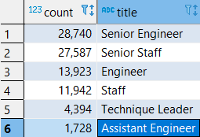

# Pewlett-Hackard Analysis
## Project Overview
- This analysis project provides a visualizatoin of employees nearing retirement at Pewelett-Hackard Company.The areas of focus for this project include the following:

    1.Determine the number of retiring employees per title
    
    2.Identify employees who are eligible to participate in a mentorship program
##  Results

- Six position titles (seen in the table below) are nearing retirement.
- The highest amount of title positions are as Senior Engineer followed by Senior Staff.
- The least amount of title postions are as Technique Leaders.
- The total number of eligible senior employees for the mentorship program 1,514.

## Insight and Recommendations
- Adding up the number of title positions, there is going to be about 88,314 retirement eligible employees and the number of roles that will need to be filled as the silver tsunami begins.
- The roles that will need to be filled is far less than the number of mentorship eligible senior employees.
- Possible recommendations include: 1) expanding the mentorship program within a 5 year range to have more mentors 2) Allowing senior employees to work from home, which would allow for them to work additional years and allowing  more time build up the workforce. 3) Further analysis should also look at gender and cultural diversity of the workforce, looking at need of hiring well-diverse workforce.
